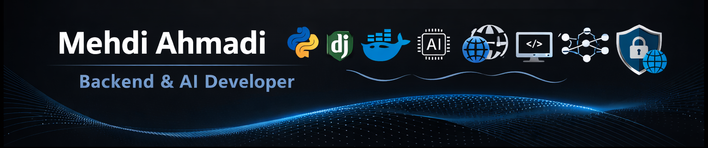

<!-- Hero Banner (Optional: Replace URL with your own) -->

  

<h1 align="center">Mehdi Ahmadi</h1>

  Computer Engineer • Backend & AI Developer

<!-- GitHub Stats -->
<!-- 

  

 -->

    <!-- Programming & Frameworks -->
    
    
    
    
    <!-- Database & SQL -->
    
    
    
    <!-- AI & Data -->
    
    
    
    
    
    
    <!-- Bots & Crawling -->
    
    

---

<table  cellpadding="15" border="2"  >
  <tr>
    <!-- English - ACTIVE -->
    <td align="center" >
      
            <a href="README.md">English</a>
      
    </td>  
    <!-- Persian - NORMAL -->
    <td align="center" >
      
        <a href="FA_README.md">فارسی</a>
      
    </td>
  </tr>
</table>

---
## فارسی 

### درباره من
مهندس کامپیوتر با تمرکز بر توسعهٔ بک‌اند، یادگیری ماشین کاربردی و پروژه‌های نرم‌افزاری پژوهش‌محور.  
دارای تجربه در توسعه با پایتون و جنگو، طراحی APIهای مقیاس‌پذیر و پیاده‌سازی سیستم‌های داده‌محور و هوشمند.

---

### مهارت‌های فنی
- 🐍 **Python**  
- 🐘 **SQL / PostgreSQL**  
- ⚛️ **PyTorch / TensorFlow**  
- 🐳 **Docker**  
- ⚙️ **Django & Django REST Framework**  
- 🛠️ **Git & Version Control**  

---

### اصول توسعه
- کدنویسی خوانا و قابل نگهداری  
- اجرای قابل بازتولید و مستندسازی کامل  
- تمرکز بر پروژه‌های پژوهشی و کاربردی  
- استفاده از لایسنس مناسب متن‌باز

---

### تماس
📫 ایمیل: [ahmadi.mehd2@gmail.com](mailto:ahmadi.mehd2@gmail.com)  
🔗 لینکدین: [mehdi-ah2](www.linkedin.com/in/mehdi-ah2)  
🌐 استک اورفلو: [mehdi-ahmadi](https://stackoverflow.com/users/16958410/mehdi-ahmadi)  
